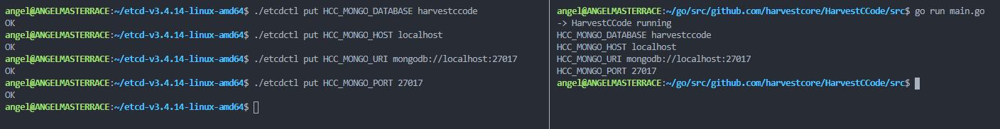

# Exercise 1

Etcd3 configuration added to my project in [this commit](https://github.com/harvestcore/HarvestCCode/commit/30ce30908c7bcb995b010bde4c80f48904051866). The source code is available [here](https://github.com/harvestcore/HarvestCCode/blob/master/src/config/config_manager.go).

# Exercise 2

Code available [here](https://github.com/harvestcore/masterdo).

# Exercise 3

Code available [here](https://github.com/harvestcore/masterdo).
