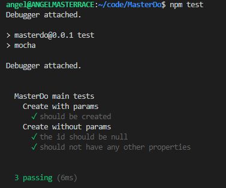

# Exercise 1

I've chosen the [n](https://github.com/tj/n) virtual environment and I've installed the following versions:

- 0.11.16
- 4.9.1
- 10.22.1
- 12.19.0
- 14.14.0
- 15.0.1 (latest one)


# Exercise 2

[MasterDo](https://github.com/harvestcore/masterdo) is the application I've chosen to code. It allows you to store all tasks that you need to do to complete your Master's degree. The `package.json` file was generated by using the `npm init` command.


# Exercise 3

I've developed a simple [Express](https://expressjs.com/) app as well as some code to manage MasterDo's. To store them I've used [PouchDB](https://pouchdb.com/), a simple lightweight non-relational database.


# Exercise 4

After running `mocha` to run the tests we can see that one of them is failing. When creating a new MasterDo, if the task is not specified the rest of the fields should not be present.


In order to fix it I've added some checks when creating and returning the data.



After all the coding the `package.json` file looks like this:


# Exercise 5

After login into TravisCI I've activated the continous integration in [this repository](https://github.com/harvestcore/masterdo). I've also created a `.travis.yml` file that will be used by Travis to run the tests.

The content of this file is the following:

```yaml
language: node_js
node_js:
  - "15.0.1"
before_install:
  - npm i
script:
  - mocha
```

Successful builds in [TravisCI#MasterDo](https://travis-ci.com/github/harvestcore/masterdo/builds)


