# Exercise 1


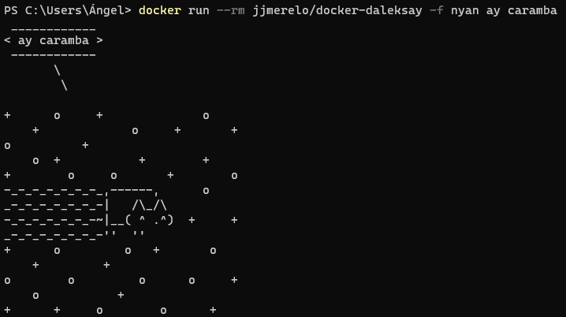

# Exercise 2

## Alpine

I'm using [this Dockerfile](dockerfiles/Dockerfile_alpine).

```Dockerfile
FROM alpine:latest

CMD ["echo", "Hello world!"]
```

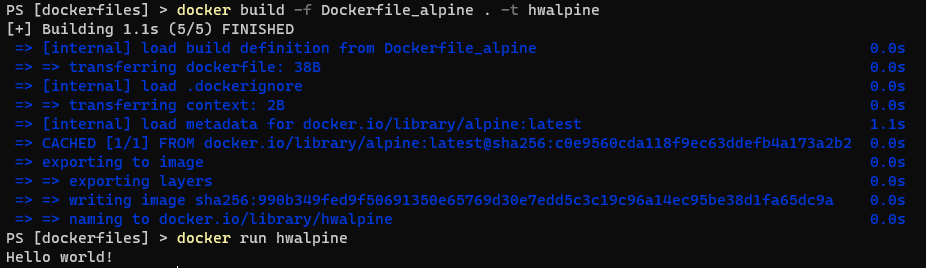

## Centos

I'm using [this Dockerfile](dockerfiles/Dockerfile_centos).

```Dockerfile
FROM centos:latest

CMD ["echo", "Hello world!"]
```

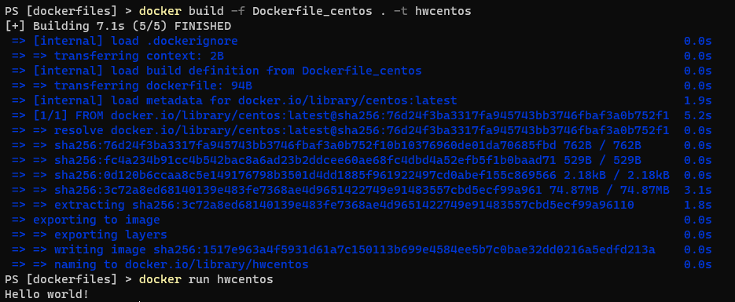

## Fedora

I'm using [this Dockerfile](dockerfiles/Dockerfile_fedora).

```Dockerfile
FROM fedora:latest

CMD ["echo", "Hello world!"]
```

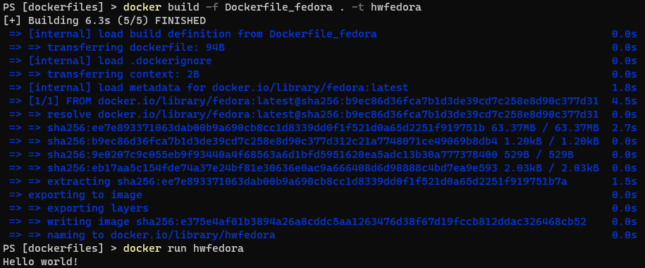

## Image size

This is the size of all generated docker images:

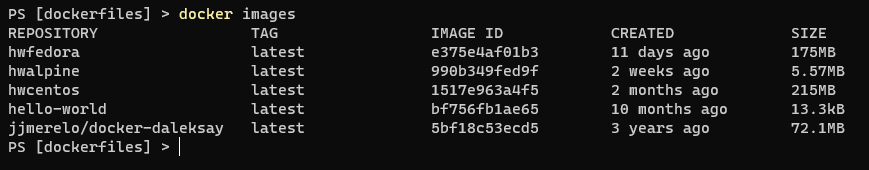

The size of the alpine image is way lower than the other ones since it is a lightweight image that does not contain any extra software installed on it.

# Exercise 3

Run the `ubuntu` image, create a sample file and commit the image:

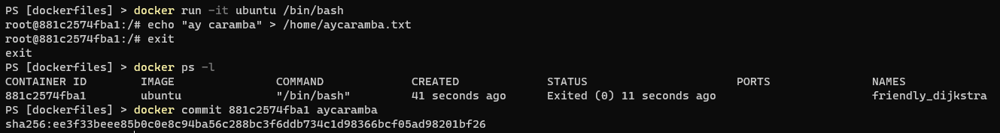

Run the image and check the sample file:

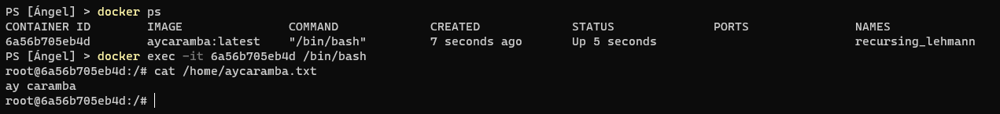

# Exercise 4

> In this exercise I'm using my [Final Degree Project](https://github.com/harvestcore/tfg).

After the build (via `docker-compose`) two main images are created: `tfg_ipmanager-frontend` and `tfg_ipmanager-backend`. When running `docker-compose up`, also a `mongo` image is run, this one used to store the data. These are the layers of the frontend and backend images:

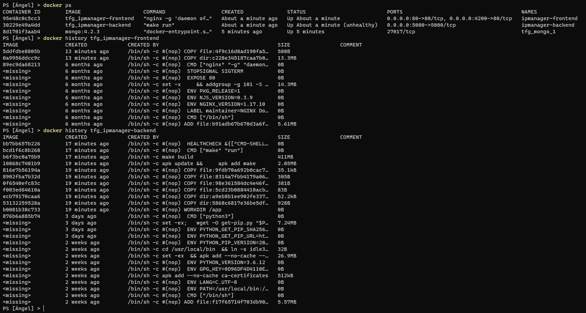

# Exercise 5

In this exercise I've used [this Dockerfile](dockerfiles/Dockerfile_alpine_volume) to create an image that runs the command `ls -lah` in the mounted volume (in `/app`):

```Dockerfile
FROM alpine:latest

CMD ["ls", "-lah", "/app"]
```

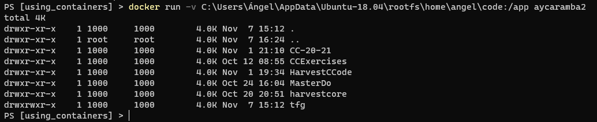

# Exercise 6

> In this exercise I'm using my [Final Degree Project](https://github.com/harvestcore/tfg).

Right after running `docker-compose up`:

> Note: The image does not include the whole console output since it is quite long.

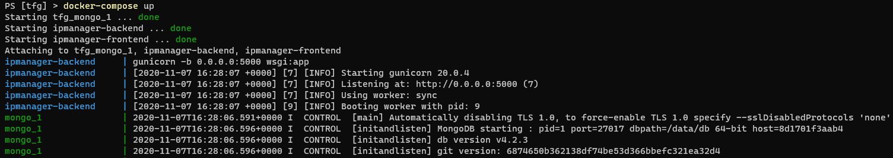

Backend swagger UI:

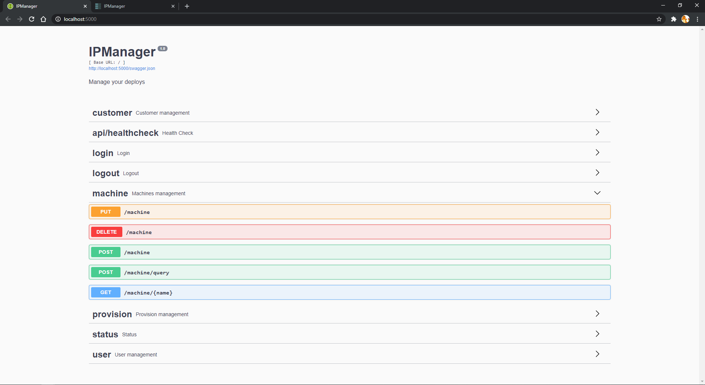

Frontend UI:

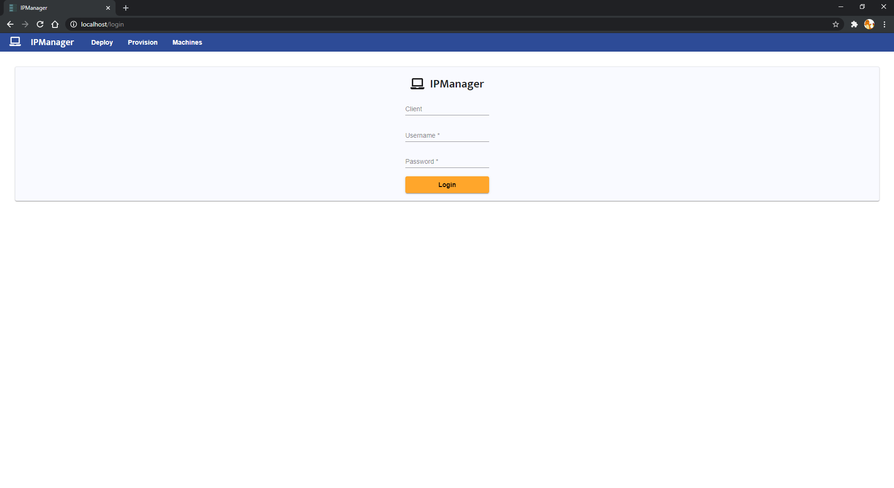

Some of the frontend container logs after some requests:

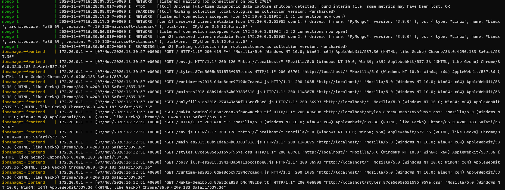

# Exercise 7

> In this exercise I'm using my [Final Degree Project](https://github.com/harvestcore/tfg).

Both the [frontend](https://github.com/harvestcore/tfg/blob/develop/frontend/Dockerfile) and the [backend](https://github.com/harvestcore/tfg/blob/develop/backend/Dockerfile) have its own Dockerfile:

Frontend:

```Dockerfile
FROM node:12.17.0-alpine as build

WORKDIR ./app

COPY package.json .
COPY angular.json .
COPY tsconfig.app.json .
COPY tsconfig.json .
COPY ./src ./src
COPY ./LICENSE .
COPY ./nginx.conf .

RUN npm install
RUN npm run build-on-premise

FROM nginx:1.17-alpine
COPY --from=build /app/dist/frontend /usr/share/nginx/html
COPY --from=build /app/nginx.conf /etc/nginx/
```

Backend:

```Dockerfile
FROM python:3.6-alpine

WORKDIR ./app

COPY ./config ./config
COPY ./src ./src
COPY ./wsgi.py .
COPY ./Makefile .
COPY ./requirements.txt .
COPY ./LICENSE .

RUN apk update && \
    apk add make

RUN make build
CMD ["make", "run"]

HEALTHCHECK CMD curl --fail http://localhost:5000/api/healthcheck || exit 1
```

And this is the `docker-compose.yml` file:

```yml
version: '3'
services:
  ipmanager-backend:
    container_name: ipmanager-backend
    build: ./backend
    ports:
      - 5000:5000
    environment:
      - MONGO_HOSTNAME=mongo
      - BASE_DATABASE=ipm_root
    healthcheck:
      test: curl --fail -s http:localhost:5000/api/healthcheck || exit 1
      interval: 30s
      timeout: 10s
      retries: 3
    networks:
      ipm:
        ipv4_address: 172.20.0.3
    depends_on:
      - mongo

  ipmanager-frontend:
    container_name: ipmanager-frontend
    build: ./frontend
    ports:
      - 80:80
      - 4200:80
    networks:
      ipm:
        ipv4_address: 172.20.0.4
    depends_on:
      - ipmanager-backend

  mongo:
    image: mongo:4.2.3
    networks:
      ipm:
        ipv4_address: 172.20.0.2

networks:
  ipm:
    driver: bridge
    ipam:
      config:
        - subnet: 172.20.0.0/16
```
